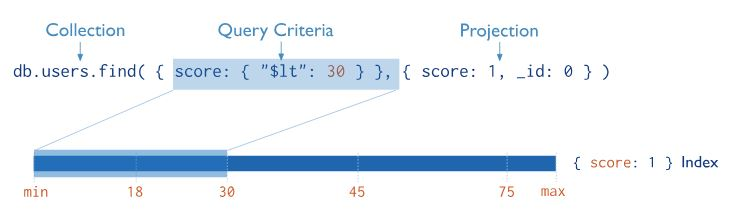

### MongoDB索引

索引支持在MongoDB中高效执行查询。如果没有索引，MongoDB必须执行集合扫描，即扫描集合中的每个文档，以选择与查询语句匹配的文档。如果查询存在适当的索引，MongoDB可以使用该索引限制它必须检查的文档数量，从而极大的提高查询的效率。

索引是特殊的数据结构（MongoDB索引使用B树数据结构），它以易于遍历的形式存储集合数据集的一小部分。索引存储按字段值排序的特定字段或一组字段的值。索引项的排序支持有效的相等匹配和基于范围的查询操作。

#### Default `_id` Index	 默认的_id索引

MongoDB在创建集合期间在`_id`字段上创建一个唯一的索引。`_id`索引阻止客户端为id字段插入两个值相同的文档。不能在`_id`字段中删除此索引。

#### Create an Index	创建索引

```
db.collection.createIndex( <key and index type specification>, <options> )
```

下面的示例在name字段上创建一个单键降序索引：

```
db.collection.createIndex( { name: -1 } )
```

##### Index Names	索引名

索引的默认名称是将索引键和每个键在索引(即1或-1)中的方向连接起来，使用下划线作为分隔符。例如，在{Item：1，Quantity：-1}上创建的索引名为item_1_quantity_-1

也可以自定义索引名，下面的createIndex()方法在字段item和quantity上创建了一个名为query for inventory的索引：

```
db.products.createIndex(
  { item: 1, quantity: -1 } ,
  { name: "query for inventory" }
)
```

#### Index Types	索引类型

MongoDB提供了许多不同的索引类型来支持特定类型的数据和查询。

- **Single Field	单个字段的索引**

  单字段索引中顺序（升序或降序）不重要

- **Compound Index	多个字段的复合索引**

  复合索引中列出的字段的顺序具有重要意义。

  例如，如果复合索引由{userid：1，score：-1}组成，则索引首先按userid排序，然后在每个userid值内按score排序

- **Multikey Index**    **多键索引**

  MongoDB使用多键索引来索引存储在数组中的内容。如果对一个存放数组值的字段进行索引，MongoDB就会为数组的每个元素创建单独的索引条目。这些多键索引允许查询通过对数组的元素或元素进行匹配来选择包含数组的文档。如果索引字段包含一个数组值，MongoDB会自动决定是否创建多键索引；不需要明确指定多键类型。

  

- **Geospatial Index**    **空间索引**

  为了支持对地理空间坐标数据的有效查询，MongoDB提供了两个特殊的索引：返回结果时使用平面几何的2d indexes和使用球形几何学返回结果的2dsphere indexes

- **Text Indexes**    **文本索引**

  MongoDB提供了一个文本索引类型，它支持在集合中搜索字符串内容。这些文本索引不存储特定于语言的停顿词(例如“the”、“a”、“or”)，并且在集合中阻止单词只存储根单词。

- **Hashed Indexes    哈希索引**

  为了支持基于散列的切分，MongoDB提供了哈希索引类型，该类型对字段值的哈希进行索引。这些索引在它们的范围内有更多的随机值分布，但是只支持相等的匹配，并且不能支持基于范围的查询。

#### Index Properties    索引属性

- **Unique Indexes**    **唯一索引**

  索引的唯一属性导致MongoDB拒绝索引字段的重复值。除唯一约束外，唯一索引在功能上可与其他MongoDB索引互换

  在单一字段上创建唯一索引，可用于**数据去重**

  ```javascript
  db.members.createIndex( { "user_id": 1 }, { unique: true } ) //创建后不允许user_id字段有重复的值
  ```

- **Partial Indexes    部分索引**

  部分索引仅索引集合中满足指定筛选器表达式的文档。通过索引集合中的文档子集，部分索引具有较低的存储需求，并降低了索引创建和维护的性能成本。

  部分索引提供了稀疏索引功能的超集，应该优于稀疏索引。

- **Sparse Indexes    稀疏索引**

  索引的稀疏属性确保索引只包含具有索引字段的文档的条目。索引跳过没有索引字段的文档。

- **TTL Indexes**    **生存时间索引**

  TTL索引是MongoDB可以用来在一定时间后自动从集合中删除文档的特殊索引。对于某些类型的信息，如机器生成的事件数据、日志和会话信息，这些信息只需要在数据库中持续有限的时间，这是非常理想的。

  For example, to create a TTL index on the `lastModifiedDate` field of the `eventlog` collection，给索引设置过期时间：

  ```
  db.eventlog.createIndex( { "lastModifiedDate": 1 }, { expireAfterSeconds: 3600 } )
  ```

- **Hidden Indexes**    **隐藏索引**

  隐藏索引对查询规划器不可见，不能用于支持查询。

  通过将索引从规划器中隐藏，用户可以在不实际不删除索引的情况下评估删除索引的潜在影响。如果影响是负面的，用户可以取消隐藏索引，而不必重新创建一个被丢弃的索引。而且由于索引在隐藏时是完全维护的，所以一旦取消隐藏，索引就可以立即使用。

  除了_id索引之外，您可以隐藏任何索引。

#### Indexes and Collation    索引与排序规则

排序规则允许用户为字符串比较指定特定于语言的规则，例如用于字母和重音标记的规则。

若要使用索引进行字符串比较，操作还必须指定相同的排序规则。也就是说，如果带有排序规则的索引指定了不同的排序规则，则该索引不能支持在索引字段上执行字符串比较的操作。

例如，集合myColl在字符串字段category上有一个索引，其排序规则区域设置为“fr”

```
db.myColl.createIndex( { category: 1 }, { collation: { locale: "fr" } } )
```

以下查询操作指定与索引相同的排序规则，可以使用该索引：

```
db.myColl.find( { category: "cafe" } ).collation( { locale: "fr" } )
```

但是，以下查询操作(默认情况下使用“简单”二进制排序器)不能使用该索引：

```
db.myColl.find( { category: "cafe" } )
```

对于索引前缀键不是字符串、数组和嵌入文档的复合索引，指定不同排序规则的操作仍然可以使用索引来支持对索引前缀键的比较。

例如，集合myColl对数值字段score和price以及string字段category有一个复合索引；该索引是用排序规则区域设置“fr”创建的，用于字符串比较：

```
db.myColl.createIndex(
   { score: 1, price: 1, category: 1 },
   { collation: { locale: "fr" } } 
)
```

以下操作使用“简单”二进制排序规则进行字符串比较，可以使用该索引：

```
db.myColl.find( { score: 5 } ).sort( { price: 1 } )
db.myColl.find( { score: 5, price: { $gt: NumberDecimal( "10" ) } } ).sort( { price: 1 } )
```

以下操作在索引类别字段上使用“简单”二进制排序规则对字符串进行比较，可以使用该索引来实现分数：查询的5部分：

```
db.myColl.find( { score: 5, category: "cafe" } )
```

#### Covered Queries	覆盖查询

当查询条件和查询的投影只包括索引字段时，MongoDB直接从索引返回结果，而不扫描任何文档或将文档带入内存。这些覆盖的查询可以非常高效。



#### Index Use    索引使用

索引可以提高读取操作的效率。有索引和不带索引的查询的执行统计信息

##### 评估查询的执行效率   db.collection.find().explain("executionStats")

- 无索引查询

  ```javascript
  db.inventory.find(
     { quantity: { $gte: 100, $lte: 200 } }
  ).explain("executionStats")
  ```
  
  结果：
  
  ```javascript
  {
     "queryPlanner" : {
           "plannerVersion" : 1,
           ...
           "winningPlan" : {
              "stage" : "COLLSCAN",  //COLLSCAN表明是集合扫描的方式，即逐个文档进行扫描
              ...
           }
     },
     "executionStats" : {
        "executionSuccess" : true,
        "nReturned" : 3,  //表示查询匹配到3个文档
        "executionTimeMillis" : 0, //查询执行时间 毫秒
        "totalKeysExamined" : 0,  //表示查询没使用索引
        "totalDocsExamined" : 10,  //表示MongoDB必须扫描10个文档(即集合中的所有文档)才能找到三个匹配的文档。
        "executionStages" : {
           "stage" : "COLLSCAN",
           ...
        },
        ...
     },
     ...
  }
  ```

- 索引查询

  ```javascript
  db.inventory.createIndex( { quantity: 1 } ) // 创建索引
  db.inventory.find(
     { quantity: { $gte: 100, $lte: 200 } }
  ).explain("executionStats")
  ```

  结果：

  ```javascript
  {
     "queryPlanner" : {
           "plannerVersion" : 1,
           ...
           "winningPlan" : {
                 "stage" : "FETCH",
                 "inputStage" : {
                    "stage" : "IXSCAN",  //表明使用索引
                    "keyPattern" : {
                       "quantity" : 1
                    },
                    ...
                 }
           },
           "rejectedPlans" : [ ]
     },
     "executionStats" : {
           "executionSuccess" : true,
           "nReturned" : 3,  // 表示查询匹配到3个文档
           "executionTimeMillis" : 0, //查询执行时间 毫秒
           "totalKeysExamined" : 3,  //表明MongoDB扫描了三个索引项。所检查的键数与返回的文档数相匹配，意味着只需检查索引键就可以返回结果。不需要扫描所有的文档
           "totalDocsExamined" : 3, //表明只扫描了三个文档
           "executionStages" : {
              ...
           },
           ...
     },
     ...
  }
  ```

##### 查看集合中的索引

```
db.col.getIndexes()
```

##### 查看集合索引大小

```
db.col.totalIndexSize()
```

##### 删除集合中所有索引  （集合中自带的默认索引 _id index 是不能被删除的）

```
db.col.dropIndexes()
```

##### 删除集合中指定索引

```
db.col.dropIndex("索引名称")
```