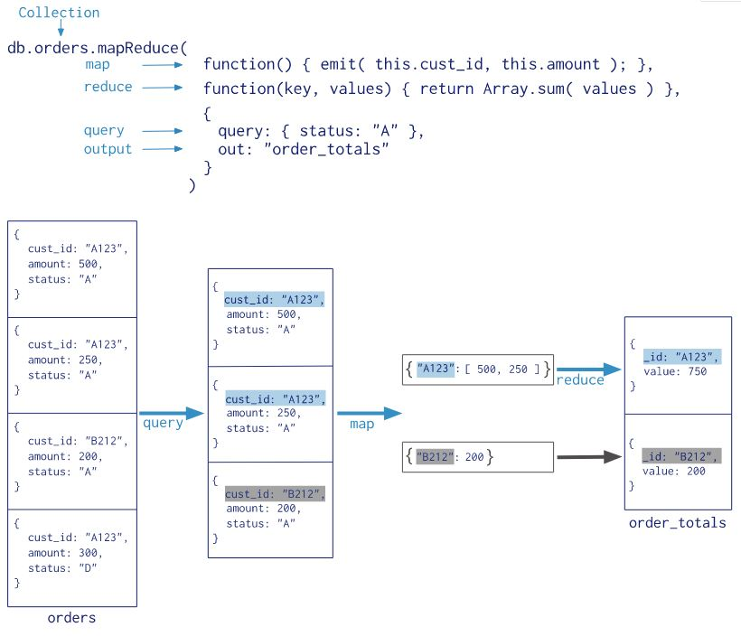

### MongoDB 聚合操作

聚合操作处理数据记录并返回计算结果。聚合操作将多个文档中的值分组在一起，并可以对分组后的数据进行各种操作，以返回一个结果。MongoDB提供了三种执行聚合的方法：the [aggregation pipeline](https://docs.mongodb.com/manual/aggregation/#aggregation-framework), the [map-reduce function](https://docs.mongodb.com/manual/aggregation/#aggregation-map-reduce), and [single purpose aggregation methods](https://docs.mongodb.com/manual/aggregation/#single-purpose-agg-operations).

#### Aggregation Pipeline 聚合管道

MongoDB的聚合管道将MongoDB文档在一个管道处理完毕后将结果传递给下一个管道处理。管道操作是可以重复的。

文档进入一个多阶段的pipeline，将文档转化为一个汇总的结果。

example:

```javascript
db.orders.aggregate([
   { $match: { status: "A" } },
   { $group: { _id: "$cust_id", total: { $sum: "$amount" } } }
])
```

1. 第一阶段：The [`$match`](https://docs.mongodb.com/manual/reference/operator/aggregation/match/#pipe._S_match) stage filters the documents by the `status` field and passes to the next stage those documents that have `status` equal to `"A"`

   通过$match 阶段过滤指定字段的文档

2. 第二阶段：The [`$group`](https://docs.mongodb.com/manual/reference/operator/aggregation/group/#pipe._S_group) stage groups the documents by the `cust_id` field to calculate the sum of the amount for each unique `cust_id`. 

   $group阶段按cust_id字段对文档进行分组，计算每个唯一cust_id的amount 之和


##### 聚合操作中常用的管道操作

- $project：修改输入文档的结构。可以用来重命名、增加或删除域，也可以用于创建计算结果以及嵌套文档。

- $match：用于过滤数据，只输出符合条件的文档。$match使用MongoDB的标准查询操作。

- $limit：用来限制MongoDB聚合管道返回的文档数。

- $skip：在聚合管道中跳过指定数量的文档，并返回余下的文档。

- $unwind：将文档中的某一个数组类型字段拆分成多条，每条包含数组中的一个值。

- $group：将集合中的文档分组，可用于统计结果。

- $sort：将输入文档排序后输出。

- $geoNear：输出接近某一地理位置的有序文档。

  [更多管道操作查看官方文档](https://docs.mongodb.com/manual/reference/operator/aggregation-pipeline/ )

##### 管道内部常用的表达式		  语法：表达式：‘$列名’

- $sum：计算总和，$sum:1 表示以一倍计数

- $avg：计算平均值

- $min：获取最大值

- $max：获取最小值

- $push：在结果文档中插入值到一个数组中

- $first：根据文档排序获取第一个文档数据

- $last：根据文档排序获取最后一个文档数据

  [更多表达式查看官方文档](https://docs.mongodb.com/manual/meta/aggregation-quick-reference/index.html#index-of-expression-operators)

ex1：

```
db.article.aggregate(
    { $project : {
        title : 1 ,
        author : 1 ,
    }}
 );
```

通过该管道后只有_id, tilte和author三个字段了，默认情况下 _id字段是被包含的，如果要想不包含 _id可以将 _id的属性设为0, 即为：

```
db.article.aggregate(
    { $project : {
        _id : 0 ,
        title : 1 ,
        author : 1
    }});
```

ex2：
```javascript
db.sales.insertMany([
  { "_id" : 1, "item" : "abc", "price" : NumberDecimal("10"), "quantity" : NumberInt("2"), "date" : ISODate("2014-03-01T08:00:00Z") },
  { "_id" : 2, "item" : "jkl", "price" : NumberDecimal("20"), "quantity" : NumberInt("1"), "date" : ISODate("2014-03-01T09:00:00Z") },
  { "_id" : 3, "item" : "xyz", "price" : NumberDecimal("5"), "quantity" : NumberInt( "10"), "date" : ISODate("2014-03-15T09:00:00Z") },
  { "_id" : 4, "item" : "xyz", "price" : NumberDecimal("5"), "quantity" :  NumberInt("20") , "date" : ISODate("2014-04-04T11:21:39.736Z") },
  { "_id" : 5, "item" : "abc", "price" : NumberDecimal("10"), "quantity" : NumberInt("10") , "date" : ISODate("2014-04-04T21:23:13.331Z") },
  { "_id" : 6, "item" : "def", "price" : NumberDecimal("7.5"), "quantity": NumberInt("5" ) , "date" : ISODate("2015-06-04T05:08:13Z") },
  { "_id" : 7, "item" : "def", "price" : NumberDecimal("7.5"), "quantity": NumberInt("10") , "date" : ISODate("2015-09-10T08:43:00Z") },
  { "_id" : 8, "item" : "abc", "price" : NumberDecimal("10"), "quantity" : NumberInt("5" ) , "date" : ISODate("2016-02-06T20:20:13Z") },
])
```

根据item分组并求出分组后price的平均值和总和
```javascript
db.sales.aggregate([ 
	{ $group : { _id : "$item", avg_price: {$avg:"$price"}, sum_price: {$sum: "$price"} } } 
])

{ "_id" : "def", "avg_price" : NumberDecimal("7.5"), "sum_price" : NumberDecimal("15.0") }
{ "_id" : "xyz", "avg_price" : NumberDecimal("5"), "sum_price" : NumberDecimal("10") }
{ "_id" : "abc", "avg_price" : NumberDecimal("10"), "sum_price" : NumberDecimal("30") }
{ "_id" : "jkl", "avg_price" : NumberDecimal("20"), "sum_price" : NumberDecimal("20") }
```

 uses the [`$group`](https://docs.mongodb.com/manual/reference/operator/aggregation/group/#pipe._S_group) stage to count the number of documents in the `sales`collection:

$group 中_id设为空或者其他任何常量，相当于将输入文档作为一个整体，也就是整体作为一个组进行后续计算

```javascript
db.sales.aggregate([
	{ $group: { _id: null, count: { $sum: 1 } } }
])

{ "_id" : null, "count" : 8 }
```

根据item分组并求出每项产品的销售总额，然后返回销售总额大于等于100的item

```javascript
db.sales.aggregate([
    { $group :
        { _id : "$item",
          totalSaleAmount: { $sum: { $multiply: [ "$price", "$quantity" ] } }
        }
    },
    {
       $match: { "totalSaleAmount": { $gte: 100 } }
    }
])

{ "_id" : "xyz", "totalSaleAmount" : NumberDecimal("150") }
{ "_id" : "abc", "totalSaleAmount" : NumberDecimal("170") }
{ "_id" : "def", "totalSaleAmount" : NumberDecimal("112.5") }
```

The following pipeline calculates the total sales amount, average sales quantity, and sale count for each day in the year 2014

计算2014年每一天的总销售额、平均销售量和销售数量，最后按照每组的销售总额降序排序，1表示升序，-1表示降序

```javascript
db.sales.aggregate([
  // First Stage
  {
    $match : { "date": { $gte: new ISODate("2014-01-01"), $lt: new ISODate("2015-01-01") } }
  },
  // Second Stage
  {
    $group : {
       _id : { $dateToString: { format: "%Y-%m-%d", date: "$date" } },
       totalSaleAmount: { $sum: { $multiply: [ "$price", "$quantity" ] } },
       averageQuantity: { $avg: "$quantity" },
       count: { $sum: 1 }
    }
  },
  // Third Stage
  {
    $sort : { totalSaleAmount: -1 }
  }
 ])

{ "_id" : "2014-04-04", "totalSaleAmount" : NumberDecimal("200"), "averageQuantity" : 15, "count" : 2 }
{ "_id" : "2014-03-15", "totalSaleAmount" : NumberDecimal("50"), "averageQuantity" : 10, "count" : 1 }
{ "_id" : "2014-03-01", "totalSaleAmount" : NumberDecimal("40"), "averageQuantity" : 1.5, "count" : 2 }
```

The following aggregation operation specifies a group `_id` of `null`, calculating the total sale amount, average quantity, and count of *all* documents in the collection.

计算集合中所有文档的总销售额、平均数量和计数

```javascript
db.sales.aggregate([
  {
    $group : {
       _id : null,
       totalSaleAmount: { $sum: { $multiply: [ "$price", "$quantity" ] } },
       averageQuantity: { $avg: "$quantity" },
       count: { $sum: 1 }
    }
  }
 ])
 
 { "_id" : null, "totalSaleAmount" : NumberDecimal("452.5"), "averageQuantity" : 7.875, "count" : 8 }
```

ex3（Pivot Data）:

```javascript
db.books.insertMany([
  { "_id" : 8751, "title" : "The Banquet", "author" : "Dante", "copies" : 2 },
  { "_id" : 8752, "title" : "Divine Comedy", "author" : "Dante", "copies" : 1 },
  { "_id" : 8645, "title" : "Eclogues", "author" : "Dante", "copies" : 2 },
  { "_id" : 7000, "title" : "The Odyssey", "author" : "Homer", "copies" : 10 },
  { "_id" : 7020, "title" : "Iliad", "author" : "Homer", "copies" : 10 }
])
```

The following aggregation operation pivots the data in the `books` collection to have titles grouped by authors

将图书集合中的数据转换为按作者分组的标题列表。$push 将值插入到一个数组中

```javascript
db.books.aggregate([
   { $group : { _id : "$author", books: { $push: "$title" } } }
 ])
 
{ "_id" : "Homer", "books" : [ "The Odyssey", "Iliad" ] }
{ "_id" : "Dante", "books" : [ "The Banquet", "Divine Comedy", "Eclogues" ] }
```

The following aggregation operation groups documents by `author`  通过author对文档进行分组

$$ROOT 是聚合表达式总的变量名，属于系统变量，这里ROOT表示引用当前正在聚合管道阶段处理的根文档，即顶级文档。这里相当于把一个完整文档添加到数组中。

$addfield在输出中添加一个字段，其中包含每个作者的图书总拷贝数。

[聚合表达式中的变量官方说明](https://docs.mongodb.com/manual/reference/aggregation-variables/#variable.ROOT)

```javascript
db.books.aggregate([
   // First Stage
   {
     $group : { _id : "$author", books: { $push: "$$ROOT" } }
   },
   // Second Stage
   {
     $addFields:
       {
         totalCopies : { $sum: "$books.copies" }
       }
   }
 ])

{
  "_id" : "Homer",
  "books" :
     [
       { "_id" : 7000, "title" : "The Odyssey", "author" : "Homer", "copies" : 10 },
       { "_id" : 7020, "title" : "Iliad", "author" : "Homer", "copies" : 10 }
     ],
   "totalCopies" : 20
}

{
  "_id" : "Dante",
  "books" :
     [
       { "_id" : 8751, "title" : "The Banquet", "author" : "Dante", "copies" : 2 },
       { "_id" : 8752, "title" : "Divine Comedy", "author" : "Dante", "copies" : 1 },
       { "_id" : 8645, "title" : "Eclogues", "author" : "Dante", "copies" : 2 }
     ],
   "totalCopies" : 5
}
```

ex4:

uses the [`$unwind`](https://docs.mongodb.com/manual/reference/operator/aggregation/unwind/#pipe._S_unwind) stage to output a document for each element in the `sizes` array 使用$unwind拆分数组

```
db.inventory.insertOne({ "_id" : 1, "item" : "ABC1", sizes: [ "S", "M", "L"] })
db.inventory.aggregate( [ { $unwind : "$sizes" } ] )

{ "_id" : 1, "item" : "ABC1", "sizes" : "S" }
{ "_id" : 1, "item" : "ABC1", "sizes" : "M" }
{ "_id" : 1, "item" : "ABC1", "sizes" : "L" }
```

#### Map-Reduce Function

MongoDB还提供map-reduce操作来执行聚合。Map-reduce使用自定义JavaScript函数来执行map和reduce操作，以及可选的finalize操作。



#### Single Purpose Aggregation Operations  单一目的聚合操作

MongoDB 也提供 [`db.collection.estimatedDocumentCount()`](https://docs.mongodb.com/manual/reference/method/db.collection.estimatedDocumentCount/#db.collection.estimatedDocumentCount), [`db.collection.count()`](https://docs.mongodb.com/manual/reference/method/db.collection.count/#db.collection.count) and [`db.collection.distinct()`](https://docs.mongodb.com/manual/reference/method/db.collection.distinct/#db.collection.distinct).单一目的的聚合操作。

所有这些操作都从单个集合中聚合文档。虽然这些操作提供了对常见聚合过程的简单访问，但它们缺乏聚合管道和map-Reduce的灵活性和功能。


example:

- Count all Documents in a Collection

  count the number of all documents in the `orders` collection, use the following operation：

  ```
  db.orders.count()
  ```

  This operation is equivalent to the following：

  ```
  db.orders.find().count()
  ```

- Count all Documents that Match a Query

  Count the number of the documents in the `orders` collection with the field `ord_dt` greater than `newDate('01/01/2012')`:

  ```
  db.orders.count( { ord_dt: { $gt: new Date('01/01/2012') } } )
  ```

  The query is equivalent to the following:

  ```
  db.orders.find( { ord_dt: { $gt: new Date('01/01/2012') } } ).count()
  ```