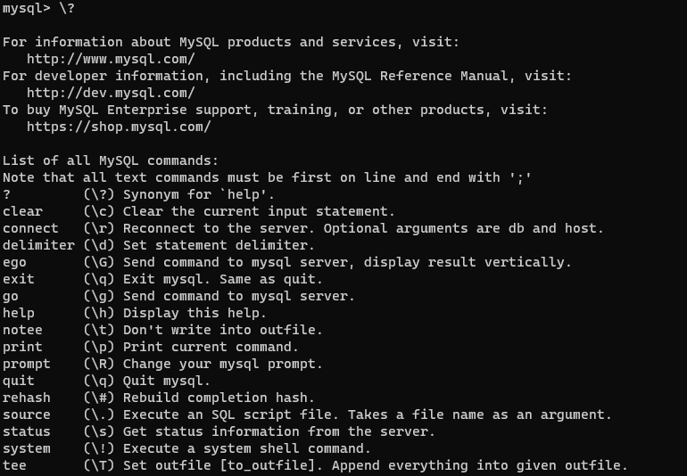
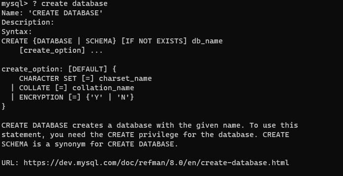

### mysql基本命令

[官方文档链接](https://dev.mysql.com/doc/refman/8.0/en/tutorial.html)

#### 基础操作命令

- 登录：`mysql -u<username> -p<password>`

  ​			`mysql -u<username> -p`  回车输入密码

  ex：管理员登录：`mysql -uroot -p`  回车输入密码

- 退出：`exit`  or  `quit` or  `\q`

- 查看数据库：`show databases;`
- 创建数据库：`create database <datase_name>;`
- 删除数据库：`drop database <database_name>;`

- 使用/切换数据库：`use <database_name>;`
- 查看当前使用的数据库：`select database();`
- 查看当前数据库中的数据表：`show tables;`
- 删除数据表：`drop table <table_name>;`

- 查看某一个表的字段描述：`desc <table_name>;`

- 查看建表语句：`show create table <table_name>;`

  可以在sql语句后加 `\G` 表示查询结果按列打印，查看效果方便：`show create table <table_name> \G`

#### myslq实用技巧

命令帮助查看：`/?` or `/help`
    

利用命令行自带的帮助文档去查看某个命令详情：

ex：例如想了解create database参数，直接在MySQL命令行输入 `? create database` 即可，命令行会自动输出相关内容并且给出文档		链接
	

#### SQL语句分类

- DQL（Data Query Language）: 数据库查询语句，基本的就是select查询命令，用于查询数据
- DML（Data Manipulation Language）: 数据操纵语句，用于插入，更新，删除数据，即INSERT, UPDATE,DELETE
- DDL（Data Definition Language）: 数据定义语句，用于创建，删除，以及修改表，索引等数据库对象,CREATE,DRIO,ALTER
- DCL（Data Control Language）: 数据库控制语句，用于授权，角色控制等，GRANT,REVOKE,COMMIT,ROLLBACK

#### SQL语句

- 创建表

  ```sql
  CREATE TABLE table_name (
  	col01_name data_type,
  	col02_name data_type,
  	col03_name data_type,
  	....
  )
  ```

  data_type, 常用的有以下数据类型：

  整数：

  1. tinyint: 微整数：很小的整数占8位二进制
  2. smallint: 小整数： 小的整数 占16位二进制
  3. mediumint: 中整数：中等长度的整数，占24位二进制
  4. int: 整型，整数类型，占32位二进制

  小数

  1. float:单精度浮点数，占4个字节
  2. double:双精度，占8个字节

  日期

  1. time : 表示时间类型
  2. date: 表示日期类型 (只包含年月日 yyyy-MM-dd)
  3. datetime: 同时可以表示日期和时间类型(包含年月日十分秒，yyyy-MM-dd HH:mm:ss)
  4. timestamp: 时间戳类型，(包含年月日十分秒，yyyy-MM-dd HH:mm:ss)，如果添加数据时没有赋值，则自动插入当前的系统时间

  字符串

  1. char(m)：固定长度的字符串，大小为0-255 bytes，m 代表字符的个数，char(30) 表示可以存储 30 个字符
  
2. varchar(m)：可变长度的字符串，大小为0-65535 bytes，m代表字符个数
  
   在utf-8编码字符集中，一个英文字符代表一个字节，一个中文字符代表三个字节

  大二进制

1. tinyblob: 允许长度0-255字节
  2. blog: 允许长度为0-65535字节
3. longblog: 允许长度为0~4294967295 字节

  大文本

  1. tinytext: 允许长度 0~255 字节  
  2. text: 允许长度 0~65535 字节  
  3. mediumtext: 允许长度 0~167772150 字节  
  4. longtext: 允许长度 0~4294967295 字节

  example:

  在终端直接创建表

  ```
  mysql> create table student(
      -> id int not null auto_increment,
      -> name varchar(20) not null,
      -> age int not null,
      -> score float(3,1),
      -> birthday date,
      -> insert_time timestamp,
      -> primary key (id)
      -> );
  Query OK, 0 rows affected, 1 warning (0.28 sec)
  mysql> desc student;
  +-------------+-------------+------+-----+---------+----------------+
  | Field       | Type        | Null | Key | Default | Extra          |
  +-------------+-------------+------+-----+---------+----------------+
  | id          | int         | NO   | PRI | NULL    | auto_increment |
  | name        | varchar(20) | NO   |     | NULL    |                |
  | age         | int         | NO   |     | NULL    |                |
  | score       | float(3,1)  | YES  |     | NULL    |                |
  | birthday    | date        | YES  |     | NULL    |                |
  | insert_time | timestamp   | YES  |     | NULL    |                |
  +-------------+-------------+------+-----+---------+----------------+
  6 rows in set (0.00 sec)
  ```

  将创建表语句写入sql文件，在终端执行

  ```
  mysql> source E:\WorkSpace\db_operate\mysql\test.sql
  Query OK, 0 rows affected, 1 warning (0.23 sec)
  ```

- 修改表

  ```sql
  ALTER TABLE student RENAME TO new_student; --修改表名 
  ALTER TABLE new_student character SET utf8; -- 修改表的字符集 
  ALTER TABLE new_student ADD 列名 数据类型;  -- 给表添加列 
  ALTER TABLE new_student CHANGE 要更改列名称 要更改为的列名称;  -- 更改列名称 
  ALTER TABLE new_student MODIFY 列名 类型;  -- 更改列的类型 
  ALTER TABLE new_student DROP 列名; -- 删除表中一个列
  ```

- 插入语句

  ```sql
  INSERT INTO student VALUES (1, '张三', 18);
  INSERT INTO student (no,age,name) VALUES (1,'张三'，18)；
  ```

- 更新语句

  ```sql
  UPDATE student SET age=16;
  UPDATE student SET age=16, name="李四" WHERE no=2;
  ```

- 删除语句

  ```sql
  DELETE FROM student WHERE no=2;
  ```

  注意：如果没有WHERE 条件，将删除student表中的所有数据，不推荐使用，因为这里是有多少数据就执行多少次删除数据操作。

- 查询语句

  ```
  select 
  	字段列表
  from
  	表名列表
  where
  	条件列表
  group by
  	分组字段
  having
  	分组之后的条件
  order by
  	排序
  limit
  	分页限定
  ```


- **基础查询**

  - `select * from student；`查询数据

  - `select name,age from student;`  查询某些列的数据

  - `select distinct address from student;`  去除重复的结果集

  - `select distinct name,address from student;`  这里值name 和 address都相同的进行去重

  - `select name,math,english , math+english from student;`  计算math和english成绩之和

  - `select name,math,english,math+IFNULL(english,0) from student;`  这里的查询表示如果english是nulll的时候用0进行替换

  - `select name 名字,math 数学,english 英语,math+IFNULL(english,0) as 总分 from student;`  这里是给查询的结果起别名这里是通过as实现，也可以直接空格之后加别名

  - **条件查询**

    where子句后跟条件运算符：

    ```
    >、 <、<=、>=、=、<> 、!=
    between....and: 如between 100 and 200
    in(集合):集合表示多个值，使用逗号分隔
    like:模糊查询， 占位符：_ 表示单个任意字符 ;  % 表示多个任意字符
    is null : 查询某一列为null的值，注：不能写=null
    and 或 &&
    or 或 ||
    not 或 ！
    ```

    [更多比较运算符](https://dev.mysql.com/doc/refman/8.0/en/comparison-operators.html)

    example：
    
    - 查询年龄大于20的数据：`select * from student where age>20;`
    - 查询年龄大于等于20,小于等于30：`select * from student where age>=20 and age<=30;`
    - 查询年龄大于等于20,小于等于30：`select * from student where age between 20 and 30;`
    - 查询22,18,24岁的数据：`select * from student where age=22 or age=18 or age=24;`
    - 查询22,18,24岁的数据：`select * from student where age in (22,18,24);`
    - `select * from student where english is null;` 这里切忌不能使用= 或者 !=
    - `select * from student where english is not null;`
    - `select * from student where name like '赵%';` 查询姓赵的人
    - `select * from student where name like '_华%';` 查询名字第二个是华的数据
    - `select * from student where name like '___';` 查询名字为3个字的数据
    - `select * from student where name like '%马%';` 查询名字包含马的数据

- **排序查询**

  oder by 排序字段 排序方式（asc, desc）

  - `select * from student order by math;` 按照数学成绩排序，默认位升序(asc)
  - `select * from student order by math desc, english desc;` 按数学成绩进行排序，如果math成绩一样，按照english成绩进行排序。 第二排序条件只有当第一排序条件无法排序时才会执行

- **聚合函数**

  将一列数据作为一个整体，进行纵向的计算。

  count: 计算个数

  max: 计算最大值

  min: 计算最小值

  sum: 求和

  注意：聚合函数的计算都是排除了null值

  avg: 计算平均值

  - `select count(name) from student;` 查询student表一共有多少学生
  - `select count(ifnull(english,0)) from student;` 防止为null计算数目不对的问题
  - `select count(*) from sutdent;`
  - `select count(id) from student;`
  - `select max(english) from student;` 查询英语成绩最高的数据
  - `select min(english) from student;` 查询英语成绩最低的数据
  - `select sum(english) from student;` 查询英语成绩的总分
  - `select avg(english) from student;` 查询英语成绩的平均分

- **分组查询**

  语法： group by 分组字段

  注意：分组之后查询的字段：要么是分组字段，要么是聚合函数

  **where 和 having 的区别：**

  where 在分组之前进行限定，如果不满足条件，则不参与分组。having 在分组之后进行限定，如果不满足结果，则不会被查询出来。

  where 后不可以跟聚合函数，having可以进行聚合函数的判断。

  - `select sex, avg(math) from student group by sex;` 计算男女同学的数据平均成绩
  - `select sex, count(id) from student group by sex;` 计算男女的人数
  - `select sex, avg(math) from student where math>70 group by sex;` 计算数学成绩大于70分的男女同学的数据平均成绩
  - `select sex, avg(math), count(id) from student where math>70 gorup by sex having count(id) >2;` having条件一定是在group by 分组之后

- **分页查询**

  语法： limit 开始索引，每页查询的条数

  - `select * from student limit 0,3;` 查询第一页，每页3条数据
  - `select * from student limit 3,3;`查询第二页，每页3条数据
  - `select * from student limit 6,3;`查询第三页，每页3条数据
  
- **UNION操作**

  UNION 操作符用于连接两个以上的 SELECT 语句的结果组合到一个结果集合中。多个 SELECT 语句会删除重复的数据

  UNION 语句：用于将不同表中相同列中查询的数据展示出来；（不包括重复数据）

  UNION ALL 语句：用于将不同表中相同列中查询的数据展示出来；（包括重复数据）

  ```sql
  SELECT 列名称 FROM 表名称 UNION SELECT 列名称 FROM 表名称 ORDER BY 列名称；
  SELECT 列名称 FROM 表名称 UNION ALL SELECT 列名称 FROM 表名称 ORDER BY 列名称；
  ```

#### 约束
对表中的数据进行限定，保证数据的正确性，有效性和完整性

- 分类：
  - 主键约束：primary key
  - 非空约束: not null
  - 唯一约束：unique
  - 外键约束: foreign key

- 非空约束 not null

  - 创建表的时候添加约束

    ```sql
    CREATE TABLE  stu (
      id INT,
      name varchar(20) NOT NULL -- name 为非空
    );
    ```

  - 创建表之后,手动更改表字段添加非空限制

    ```sql
    alter table stu modify name varchar(20) NOT NULL; --添加非空约束
    alter table stu modify name varchar(20) NULL; --删除非空约束
    ```

- 唯一约束 unique

  某一列的值不能重复

  **注意：唯一约束可以有null值，但是只能有一条记录为null**

  - 创建表时添加唯一约束

    ```sql
    CREATE TABLE  stu (
      id INT,
      phone_number varchar(20) UNIQUE -- 手机号
    );
    ```

  - 删除唯一约束（唯一约束也是索引）：`alter table stu drop index phone_number;`

  - 创建表之后，添加唯一约束

    ```sql
    -- 创建表
    CREATE TABLE  stu (
      id INT,
      phone_number varchar(20) -- 手机号
    );
    -- 添加唯一约束
    alter table stu modify phone_number varchar(20) UNIQUE;
    -- 添加唯一约束另一种方式
    alter table table_name add unique 约束名（字段）
    alter table stu add unique phone_number (phone_number); --这里我们设置约束名和字段名一样，当然也可以不一样
    ```

  - 查看唯一性约束  `show keys from <table_name>;`

    ```sql
    mysql> show keys from student\G
    *************************** 1. row ***************************
            Table: student
       Non_unique: 0
         Key_name: PRIMARY				--约束名
     Seq_in_index: 1
      Column_name: id					--约束的字段
        Collation: A
      Cardinality: 0
         Sub_part: NULL
           Packed: NULL
             Null:
       Index_type: BTREE
          Comment:
    Index_comment:
          Visible: YES
       Expression: NULL
    *************************** 2. row ***************************
            Table: student
       Non_unique: 0
         Key_name: timecons				--约束名
     Seq_in_index: 1
      Column_name: insert_time			--约束的字段
        Collation: A
      Cardinality: 0
         Sub_part: NULL
           Packed: NULL
             Null: YES
       Index_type: BTREE
          Comment:
    Index_comment:
          Visible: YES
       Expression: NULL
    ```

- 主键约束 primary key

  概念： 非空且唯一， 且一张表只能有一个主键，但它可以由一个或多个字段组成，通俗说主键就是表中记录的唯一标识

  - 创建表时候添加主键约束

    ```sql
    -- 创建表时添加主键
    CREATE TABLE  stu (
      id INT primary key , -- 给id添加主键约束
      name varchar(20)
    );
    -- 创建表时设置多个字段为主键
    CREATE TABLE  grade (
      stu_id int,
      course_id int,
      score int,
      primary key(stu_id, course_id) -- 设置多个字段为主键
    );
    ```

  - 创建表之后添加主键：

    `alter table stu modify id int primary key ;`

    `alter table table_name add primary key (字段1,字段2...);`

  - 删除主键：`alter table stu drop primary key ;`

- 自动增长 auto_increment

  概念：如果某一列是数值类型的，使用auto_increment可以来完成值的自动增长,通常和主键一起使用，很少单独使用

  - 在创建表时添加主键约束，并完整主键自增长

    ```sql
    -- 创建表，添加主键约束，并设置主键自增长
    CREATE TABLE  stu (
      id INT primary key auto_increment, -- 给id添加主键约束,并设置自增长
      name varchar(20)
    );
    ```

  - 删除自动增长：`alter table stu modify id int;`

  - 创建表之后手动添加自增长

    ```sql
    -- 创建表，添加主键约束
    CREATE TABLE  stu (
      id INT primary key, -- 给id添加主键约束
      name varchar(20)
    );
    
    alter table stu modify id int auto_increment ;
    ```

- 外键约束 foreign key

  外键约束来保证表与表之间的数据的完整性和准确性。

  主表： 一方，用来约束别人的表

  从表： 多方， 被别人约束的表

  - 创建表的时候添加外键

    ```sql
    -- 创建部门表(id,dep_name,dep_location)
    -- 一方，主表
    create table department(
        id int primary key auto_increment,
        dep_name varchar(20),
        dep_location varchar(20)
    );
    
    -- 创建员工表(id,name,age,dep_id)
    -- 多方，从表
    create table employee(
        id int primary key auto_increment,
        name varchar(20),
        age int,
        dep_id int,-- 外键对应主表的主键
        constraint emp_depid_fk foreign key (dep_id) references department(id) -- 创建外键约束
    );
    
    -- 添加 2 个部门
    insert into department values(null, '研发部','广州'),(null, '销售部', '深圳');
    select * from department;
    -- 添加员工,dep_id 表示员工所在的部门
    INSERT INTO employee (NAME, age, dep_id) VALUES ('张三', 20, 1);
    INSERT INTO employee (NAME, age, dep_id) VALUES ('李四', 21, 1);
    INSERT INTO employee (NAME, age, dep_id) VALUES ('王五', 20, 1);
    INSERT INTO employee (NAME, age, dep_id) VALUES ('老王', 20, 2);
    INSERT INTO employee (NAME, age, dep_id) VALUES ('大王', 22, 2);
    INSERT INTO employee (NAME, age, dep_id) VALUES ('小王', 18, 2);
    ```

    这个时候我们可以尝试删除部门表中的一个数据：

    ```
    mysql> DELETE FROM department WHERE id = 1
    [2020-09-29 16:27:55] [23000][1451] Cannot delete or update a parent row: a foreign key constraint fails (`db1`.`employee`, CONSTRAINT `emp_depid_fk` FOREIGN KEY (`dep_id`) REFERENCES `department` (`id`))
    [2020-09-29 16:27:55] [23000][1451] Cannot delete or update a parent row: a foreign key constraint fails (`db1`.`employee`, CONSTRAINT `emp_depid_fk` FOREIGN KEY (`dep_id`) REFERENCES `department` (`id`))
    ```

    因为员工表与部门表有外键关联关系，所以会提示我们无法`Cannot delete or update a parent row: a foreign key constraint fails...`

  - 删除外键

    ```sql
    --  删除 employee 表的 emp_depid_fk 外键
    alter table employee drop foreign key emp_depid_fk;
    ```

  - 在employee 表已经创建的情况下，添加外键的方法

    ```sql
    -- 在 employee 表情存在的情况下添加外键
    alter table employee add constraint emp_depid_fk foreign key (dep_id) references department(id);
    ```

  - **外键的级联操作**

    |   级联操作语法    |                             描述                             |
    | :---------------: | :----------------------------------------------------------: |
    | ON UPDATE CASCADE | 级联更新，只能是创建表的时候创建级联关系。更新主表中的主键，从表中的外键 列也自动同步更新 |
    | ON DELETE CASCADE | 级联删除，删除主表中的数据时，从表中外键与之对应的数据也会删除 |

    重新创建表，并添加级联：

    ```sql
    -- 创建部门表(id,dep_name,dep_location)
    -- 一方，主表
    create table department(
        id int primary key auto_increment,
        dep_name varchar(20),
        dep_location varchar(20)
    );
    -- 创建员工表(id,name,age,dep_id)
    -- 多方，从表
    create table employee(
        id int primary key auto_increment,
        name varchar(20),
        age int,
        dep_id int,-- 外键对应主表的主键
        -- 创建外键约束, 并设置级联删除和级联更新
        constraint emp_depid_fk foreign key (dep_id) references department(id) on update cascade on delete cascade 
    
    );
    -- 添加 2 个部门
    insert into department values(null, '研发部','广州'),(null, '销售部', '深圳');
    select * from department;
    -- 添加员工,dep_id 表示员工所在的部门
    INSERT INTO employee (name, age, dep_id) VALUES ('张三', 20, 1);
    INSERT INTO employee (name, age, dep_id) VALUES ('李四', 21, 1);
    INSERT INTO employee (name, age, dep_id) VALUES ('王五', 20, 1);
    INSERT INTO employee (name, age, dep_id) VALUES ('老王', 20, 2);
    INSERT INTO employee (name, age, dep_id) VALUES ('大王', 22, 2);
    INSERT INTO employee (name, age, dep_id) VALUES ('小王', 18, 2);
    ```

    这样当我们更新部门表的id的时候会同时更新员工表中的dep_id

    同时删除了部门的数据也会把员工表dep_id等于该部门id的数据进行删除

  - 约束小结
  
    | 约束名 | 关键字      | 说明                         |
    | ------ | ----------- | ---------------------------- |
    | 主键   | primary key | 1) 唯一 2) 非空              |
    | 默认   | default     | 如果一列没有值，使用默认值   |
    | 非空   | not null    | 这一列必须有值               |
    | 唯一   | unique      | 这一列不能有重复值           |
    | 外键   | foreign key | 主表中主键列，在从表中外键列 |
  
    **注意：外键的级联慎用，根据具体情况采取相应策略**
  
    ref: https://www.cnblogs.com/zhaof/p/13751540.html