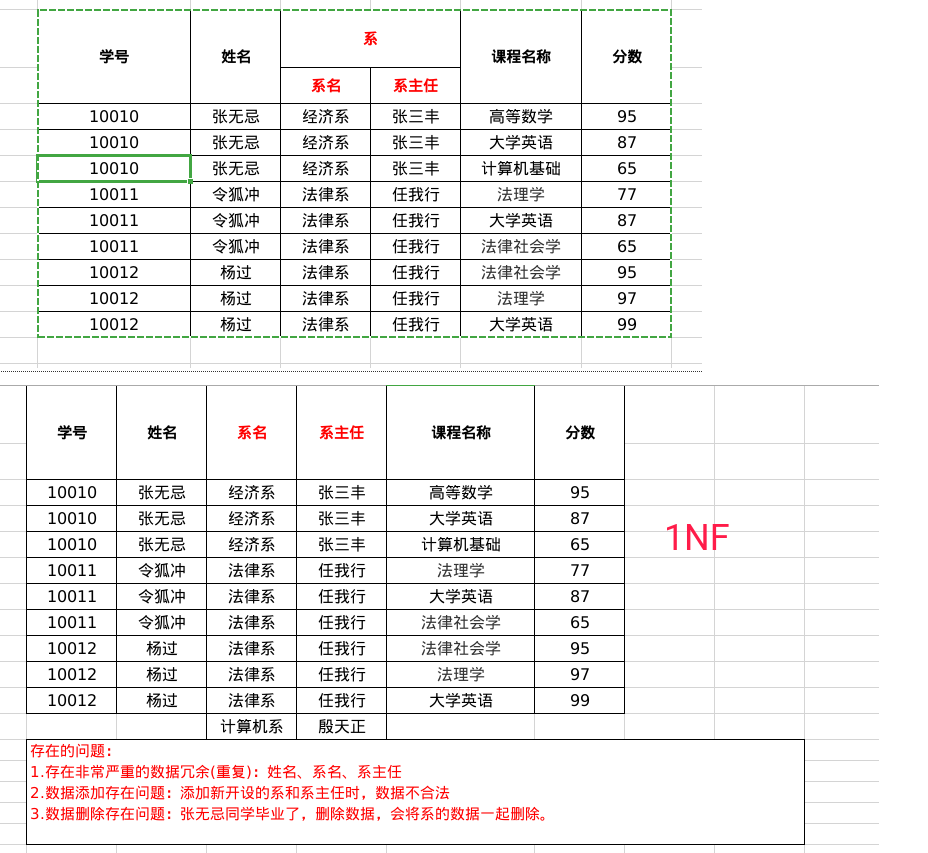
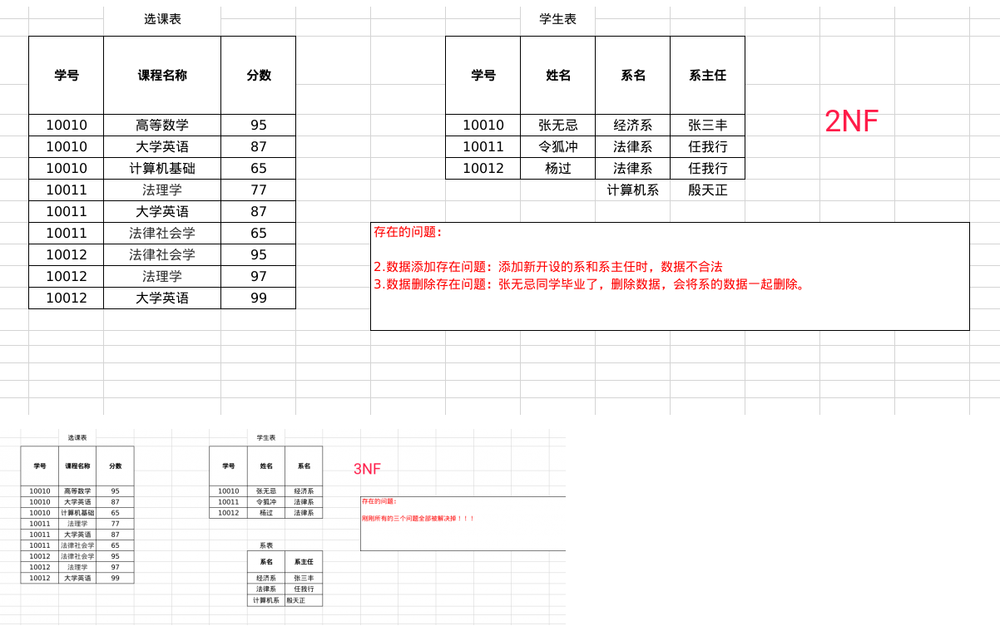

### 数据库的设计

#### 多表之间的关系

##### 分类

- 一对一

  相对了来说用的场景比较少，

  例如： 一个人和身份证号码的关系，一个人只能有一个身份证号码

- 一对多（多对一）

  例如之前笔记中的例子：部门和员工的关系

  一个部门可以有多个员工，一个员工只能属于一个部门

- 多对多

  例如学生和课程之间的关系

  一个学生可以选修多门课程，同样一门课程也可以被多个学生选修

##### 实现关系

- 一对多（多对一）

  如： 部门和员工的关系

  实现方式：在**多的一方**(员工表)去建立外键，来指向**一的一方**（部门表）的主键
  例子:

  ```sql
  -- 创建部门表(id,dep_name,dep_location)
  -- 一方，主表
  create table department(
      id int primary key auto_increment,
      dep_name varchar(20),
      dep_location varchar(20)
  );
  -- 创建员工表(id,name,age,dep_id)
  -- 多方，从表
  create table employee(
      id int primary key auto_increment,
      name varchar(20),
      age int,
      dep_id int,-- 外键对应主表的主键
      -- 创建外键约束, 并设置级联删除和级联更新
      constraint emp_depid_fk foreign key  (dep_id) references department(id) on update cascade on delete cascade
  );
  ```

- 多对多

  如：学生和课程的关系

  实现方式：多对多关系实现需要借助第三张中间表，中间表至少包含两个字段，这两个字段作为第三张表的外键，分别指向两张表（课程表和学生表）的主键

- 一对一

  如：人和身份证

  实现方式： 一对一关系实现，可以在任意一方添加唯一外键指向另一方的主键

  备注： 这种用法较少，因为这个时候通常会合成一张表

##### 实际案例

- 一对多案例

  京东和淘宝的手机分类中会有各个手机品牌，而每个手机品牌下会有很多手机型号，这就是非常典型的一对多关系

  ```mysql
  -- 创建手机品牌类别表phone_category
  -- pid 手机分类主键自动增长
  -- pname 手机类别的名字，如苹果, 小米
  create table phone_category (
      cid int primary key auto_increment,
      cname varchar(20) not null unique
  );
  
  -- 添加手机牌子
  insert into phone_category (cname) values ("苹果"), ("小米"),("三星");
  
  -- 创建具体手机表
  /*
  pid 手机表主键，自动增长
  pname 手机名字
  price 价格
  cid 外键
  */
  create table phone_name (
      pid int primary key auto_increment,
      pname varchar(20) not null unique ,
      price double,
      cid int,
      constraint foreign key (cid) references phone_category(cid)
  );
  
  -- 添加手机数据
  insert into phone_name values
                                (NULL, "IPhonex",4999.9,1),
                                (NULL, "IPhone11",5999.9,1),
                                (NUll, "mi6",1999.9,2),
                                (NUll, "mi10",2999.9,2),
                                (NUll, "s8",6999.9,3),
                                (NUll, "s10",7999.9,3);
  ```

- 多对多案例

  还是关于手机的案例，接着上面一对多的案例，其实我们再添加一个关系手机存储，就像手机有64G，128G, 256G, 不管那个手机都会有多个存储的，所以这里的手机和存储之间的关系就是多对多的关系

  ```mysql
  /*
  创建手机存储表
  mid 存储表的id,自增长
  memory 内存大小，唯一，非空
  */
  create table phone_memory (
      mid int primary key auto_increment,
      memory int not null unique
  );
  
  
  -- 添加内存数据
  insert into phone_memory values
                                  (NULL, 64),
                                  (NULL, 128),
                                  (NULL, 256);
  
  /*
   创建第三张表存手机和内存之间的关系
   mid 内存的id 外键
   pid 手机的id 外键
   */
  
   create table phone_m2m_memory(
       mid int,
       pid int,
       primary key (mid,pid),
       foreign key (mid) references phone_memory(mid),
       foreign key (pid) references phone_name(pid)
   );
  
  -- 增加手机内存数据
  
  insert into phone_m2m_memory values
                                      (1,1),
                                      (1,2),
                                      (1,3),
                                      (2,1),
                                      (2,2),
                                      (2,3),
                                      (3,1),
                                      (3,2),
                                      (3,3);
  ```

#### 数据库设计的范式

概念： 在设计数据库的时候需要遵循的规范。 要遵循后面的范式，必须先遵循前面的所有范式。

目前关系数据库有六种范式：第一范式（1NF）、第二范式（2NF）、第三范式（3NF）、巴斯-科德范式（BCNF）、第四范式(4NF）和第五范式（5NF，又称完美范式）。

掌握前三个设计出来的数据库基本不会有啥大问题

第一范式（1NF）：用一句话总结就是每一列是不可分割的原子数据项

第二范式（2NF）：在1NF的基础上，没有包含在主键中的列必须全部依赖于全部主键，而不能只依赖于主键的一部分而不依赖全部主键。						  在1NF基础上消除非主属性对主码的部分函数依赖）

第三范式 （3NF）：在2NF基础上，任何非主属性不依赖于其它非主属性（在2NF基础上消除传递依赖）

关系模式的非主键列必须直接依赖于主键，不能存在传递依赖。即不能存在：非主键列m既依赖于全部主键，又依赖于非主键列n的情况。

假设存在关系模式`主键1: 课程编号; 列1: 教师名; 列2: 教师家庭地址`。显然满足第一范式和第二范式，但是`教师家庭地址`传递依赖于`教师名`，所以不满足第三范式

概念补充：

- 函数依赖：

  A-->B,如果通过A属性(属性组)的值，可以确定唯一B属性的值。则称B依 赖于A

  例如：学号-->姓名。 （学号，课程名称） --> 分数

- 完全函数依赖：

  A-->B， 如果A是一个属性组，则B属性值的确定需要依赖于A属性组中所有的属性值。

  例如：（学号，课程名称） --> 分数

- 部分函数依赖：

  A-->B， 如果A是一个属性组，则B属性值的确定只需要依赖于A属性组中某一些值即可。

  例如：（学号，课程名称） -- > 姓名

- 传递函数依赖：

  A-->B, B -- >C . 如果通过A属性(属性组)的值，可以确定唯一B属性的值，在通过B属性（属性组）的值可以确定唯一C属性的值，则称 C 传递函数依赖于A

  例如：学号-->系名，系名-->系主任

- 码：

  如果在一张表中，一个属性或属性组，被其他所有属性所完全依赖，则称这个属性(属性组)为该表的码

  例如：成绩表中的码为：（学号，课程名称）

  主属性：码属性组中的所有属性

  非主属性：除了码属性组的属性

##### 案例





